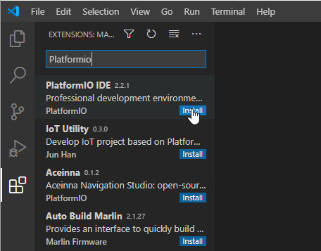
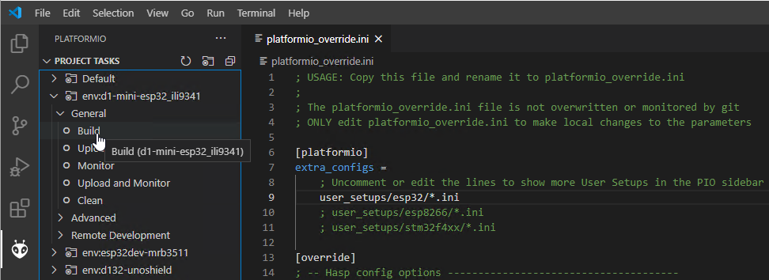
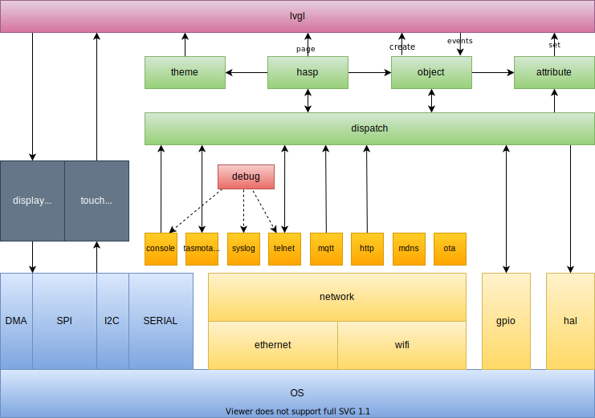

<h1>Compiling</h1>

## Clone from GitHub

Make sure to add the `--recursive` parameter when cloning the project from GitHub. Otherwise git will not download the required submodules in the `/lib` subdirectory.

```bash
git clone --recursive https://github.com/fvanroie/hasp-lvgl
```

If you already cloned hasp-lvgl without the submodules, you can fetch the submodules seperately using:

```bash
git submodule update --init --recursive
```

To switch to a different branch use:

```bash
git clone --recursive https://github.com/fvanroie/hasp-lvgl
cd hasp-lvgl
git checkout 0.2.0
git submodule update --init --recursive
```

## Open in PlatformIO



Open the project folder in [Visual Studio Code](https://code.visualstudio.com), make sure you have the PlatformIO IDE extension installed.
This will automatically install all PlatformIO dependencies and the compiler frameworks needed.


Restart Visual Studio Code when the PIO installation completes.

## Create a configuration

Copy `platformio_override-template.ini` to `platformio_override.ini` and uncomment the platforms for `esp32`and `esp8266`:

```
[platformio]
extra_configs =
	; Uncomment or edit the lines to show more User Setups in the PIO sidebar
    user_setups/esp32/*.ini
    user_setups/esp8266/*.ini
    ; user_setups/stm32f4xx/*.ini
```

Then Click on the "Refresh Project tasks" icon in PlatformIO to list all the configured environments.

## Compile Environment



You can now run "Build" or "Build All" in PlatformIO to compile (all) the firmware.

## Development

### Block Diagram



## MQTT Tests

To run the tavern testing suite, install the tavern python package and configure `test\config.yaml` with your broker settings.

```bash
pip install tavern
tavern-ci .\test\
```