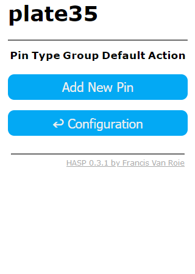

# GPIO Settings

## Web UI

You can configure the general look and feel for the interface by uploading you favorite fonts and selecting your favorite theme and color.

---

Click 'Save Settings' to save you settings to the device. A restart is required to make the settings active. Navigate back to the Main Menu and click Restart to activate the settings.

