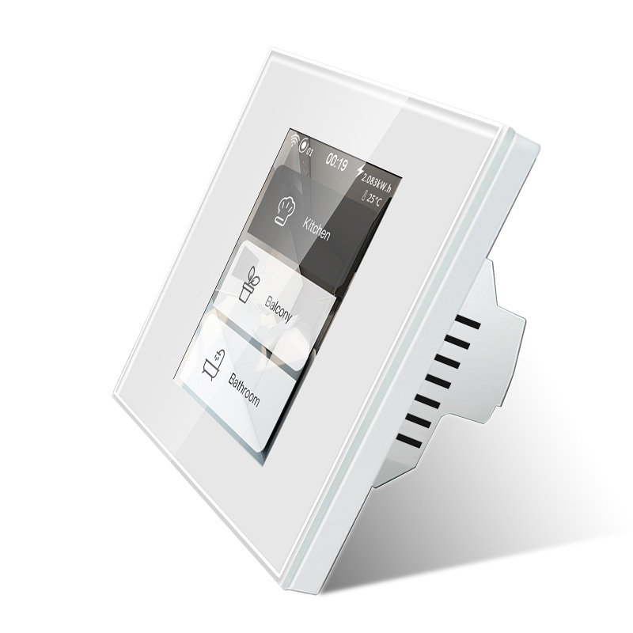

<h1>Lanbon L8</h1>



Model Number: L8-HS (switch)

- EU version 240V
- US version 110V

Features:

- ESP32-WROVER-B
- Capacitive touch screen
- 3 Relays - load up to 200W/gang
- Analog temperature sensor

!!! note "Note"
    - Model Number: L8-HD (dimmer) has not been tested!
    - Model Number: L8-HT (thermostat switch) has not been tested!
    - Model Number: L8-HB (boiler switch) has not been tested!

## Flashing

!!! warning "Disclaimer"
    Never connect high-voltage when the panel is not properly secured in place.

1. Disengage the high-voltage power
2. Detach the panel from the PSU power supply
3. Connect RX, TX, IO0, GND and power pins to the female pinheader:
     - Either supply 3.3V or 5V on the corresponding power pin, depending on the voltage supplied by the UART ttl (not both at the same time).
5. Because there is no `RESET` pin, you need to powercycle the board to activate flash mode

## GPIO Settings

Pin | Type | Group | Default
----|----|----|----
12 | Relay | 1 | Low
14 | Relay | 2 | Low
26 | Mood Red | 4 | Low
27 | Relay | 3 | Low
32 | Mood Green | 5 | Low
33 | Mood Blue  | 6 | Low

To configure all GPIOs at once use this command:

```json
config/gpio {"config":[2360346,2491680,2623009,2097420,2097678,2097947,0,0]}
```

## Demo


## LCD Configuration

The `lcd_config.ini` file specifies the different properties of the display, except for the actual pin configuration:

```ini
st7789v =
    -D ST7789_DRIVER=1
    ;-D CGRAM_OFFSET=1         ; Library will add offsets required
    -D TFT_SDA_READ            ; Read from display, it only provides an SDA pin
    -D TFT_WIDTH=240
    -D TFT_HEIGHT=320
    -D TFT_ROTATION=2          ; see TFT_ROTATION values
    ; -D TFT_INVERSION_OFF     ; for normal colors
    ; -D TFT_RGB_ORDER=TFT_RGB   ; Colour order Red-Green-Blue
    -D TFT_RGB_ORDER=TFT_BGR ; Colour order Blue-Green-Red
    -D SPI_FREQUENCY=80000000
    -D SPI_READ_FREQUENCY=6000000 
    -D USER_SETUP_LOADED=1
    -D SUPPORT_TRANSACTIONS
```

## HASP build_flags

Specify the LCD Configuration to use and define the GPIOs in the environment build flags:

```
build_flags =
    ${env.build_flags}
    ${esp32.build_flags}
    ${esp32.ps_ram}

;region -- TFT_eSPI build options ------------------------
    ${lcd.st7789v}
    -D LANBONL8
    -D TFT_RST=18        ; FCP pin2 RESET
    -D TFT_SCLK=19       ; FCP pin3 SCL
    -D TFT_DC=21         ; FCP pin4 D/C
    -D TFT_CS=22         ; FCP pin5 CS
    -D TFT_MOSI=23       ; FCP pin6 SDA
    -D TFT_MISO=25       ; FCP pin7 SDO
    -D TFT_BCKL=5
    -D TOUCH_DRIVER=5206
    -D TOUCH_SDA=4
    -D TOUCH_SCL=0
    -D TOUCH_IRQ=-1   ; not connected
    -D TOUCH_RST=-1   ; not used, connected to 3.3V on FCP pin10
    -D TOUCH_FREQUENCY=400000
    -D LED_RED=26
    -D LED_GREEN=32
    -D LED_BLUE=33
    -D RELAY_1=12
    -D RELAY_2=24
    -D RELAY_3=37
;endregion
```