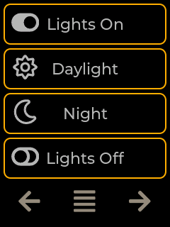
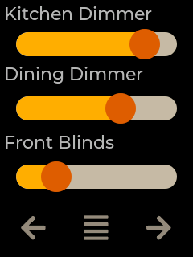
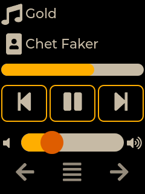

<h1>Jaffa Sunrise</h1>

## Code

This is an example of a `pages.jsonl` file:

```json
{"page":0,"comment":"---------- Page 0 ----------"}
{"obj":"btn","id":4,"page":0,"x":5,"y":5,"w":230,"h":58,"bg_color":"#000000","border_color":"#FFAC00","border_width":2,"radius":10,"radius1":10,"radius2":10,"txt":"Lights On","value_ofs_x":-85,"value_font":1,"value_str":"\uf205","value_color":"#B6B6B6","text_color":"#B6B6B6","text_font":22}
{"obj":"btn","id":5,"page":0,"x":5,"y":68,"w":230,"h":58,"bg_color":"#000000","border_color":"#FFAC00","border_width":2,"radius":10,"radius1":10,"radius2":10,"txt":"Daylight","value_ofs_x":-85,"value_font":1,"value_str":"\uf185","value_color":"#B6B6B6","text_color":"#B6B6B6","text_font":22}
{"obj":"btn","id":6,"page":0,"x":5,"y":131,"w":230,"h":58,"bg_color":"#000000","border_color":"#FFAC00","border_width":2,"radius":10,"radius1":10,"radius2":10,"txt":"Night","value_ofs_x":-85,"value_font":1,"value_str":"\uf186","value_color":"#B6B6B6","text_color":"#B6B6B6","text_font":22}
{"obj":"btn","id":7,"page":0,"x":5,"y":194,"w":230,"h":58,"bg_color":"#000000","border_color":"#FFAC00","border_width":2,"radius":10,"radius1":10,"radius2":10,"txt":"Lights Off","value_ofs_x":-85,"value_font":1,"value_str":"\uf204","value_color":"#B6B6B6","text_color":"#B6B6B6","text_font":22}

{"page":1,"comment":"---------- Page 1 ----------"}
{"obj":"label","id":8,"page":1,"x":5,"y":5,"w":230,"h":30,"bg_color":"#000000","border_color":"#C7BAA7","border_width":0,"radius":10,"radius1":10,"radius2":10,"txt":"Kitchen Dimmer","text_color":"#B6B6B6","text_font":22}
{"obj":"label","id":9,"page":1,"x":5,"y":80,"w":230,"h":30,"bg_color":"#000000","border_color":"#C7BAA7","border_width":0,"radius":10,"radius1":10,"radius2":10,"txt":"Dining Dimmer","text_color":"#B6B6B6","text_font":22}
{"obj":"label","id":10,"page":1,"x":5,"y":165,"w":230,"h":30,"bg_color":"#000000","border_color":"#C7BAA7","border_width":0,"radius":10,"radius1":10,"radius2":10,"txt":"Front Blinds","text_color":"#B6B6B6","text_font":22}
{"obj":"slider","id":11,"page":1,"x":20,"y":40,"w":200,"h":30,"bg_color":"#C7BAA7","border_color":"#C7BAA7","border_width":0,"radius":15,"radius1":15,"radius2":20,"text_font":1,"val":80,"bg_color1":"#FFAC00","bg_color2":"#DC5C05"}
{"obj":"slider","id":12,"page":1,"x":20,"y":120,"w":200,"h":30,"bg_color":"#C7BAA7","border_color":"#C7BAA7","border_width":0,"radius":15,"radius1":15,"radius2":20,"text_font":1,"val":65,"bg_color1":"#FFAC00","bg_color2":"#DC5C05"}
{"obj":"slider","id":13,"page":1,"x":20,"y":205,"w":200,"h":30,"bg_color":"#C7BAA7","border_color":"#C7BAA7","border_width":0,"radius":15,"radius1":15,"radius2":20,"text_font":1,"val":25,"bg_color1":"#FFAC00","bg_color2":"#DC5C05"}

{"page":2,"comment":"---------- Page 2 ----------"}
{"obj":"label","id":14,"page":2,"x":42,"y":10,"w":236,"h":30,"bg_color":"#000000","border_color":"#C7BAA7","border_width":0,"txt":"Gold","text_color":"#C7BAA7","text_font":22}
{"obj":"label","id":15,"page":2,"x":42,"y":60,"mode":"scroll","w":236,"h":30,"bg_color":"#000000","border_color":"#C7BAA7","border_width":0,"txt":"Chet Faker","text_color":"#C7BAA7","text_font":22}
{"obj":"btn","id":16,"page":2,"x":2,"y":140,"w":76,"h":61,"bg_color":"#000000","border_color":"#FFAC00","border_width":2,"radius":10,"radius1":10,"radius2":10,"txt":"\uf048","text_color":"#C7BAA7","text_font":1}
{"obj":"btn","id":17,"page":2,"x":82,"y":140,"w":76,"h":61,"bg_color":"#000000","border_color":"#FFAC00","border_width":2,"radius":10,"radius1":10,"radius2":10,"txt":"\uf04c","text_color":"#C7BAA7","text_font":1}
{"obj":"btn","id":18,"page":2,"x":162,"y":140,"w":76,"h":61,"bg_color":"#000000","border_color":"#FFAC00","border_width":2,"radius":10,"radius1":10,"radius2":10,"txt":"\uf051","text_color":"#C7BAA7","text_font":1}
{"obj":"bar","id":19,"page":2,"x":2,"y":105,"w":236,"h":20,"bg_color":"#C7BAA7","border_color":"#C7BAA7","border_width":0,"radius":15,"radius1":15,"radius2":15,"text_font":1,"val":65,"bg_color1":"#FFAC00"}
{"obj":"slider","id":20,"page":2,"x":35,"y":220,"w":170,"h":30,"bg_color":"#C7BAA7","border_color":"#C7BAA7","border_width":0,"radius":15,"radius1":15,"radius2":20,"text_font":1,"val":30,"bg_color1":"#FFAC00","bg_color2":"#DC5C05"}
{"obj":"label","id":21,"page":2,"x":2,"y":2,"w":40,"h":61,"bg_color":"#000000","border_color":"#C7BAA7","border_width":0,"txt":"\uf001","text_color":"#C7BAA7","text_font":1}
{"obj":"label","id":22,"page":2,"x":10,"y":51,"w":36,"h":61,"bg_color":"#000000","border_color":"#C7BAA7","border_width":0,"txt":"\uf3e0","text_color":"#C7BAA7","text_font":1}
{"obj":"label","id":23,"page":2,"x":5,"y":224,"w":25,"h":40,"bg_color":"#000000","border_color":"#C7BAA7","border_width":0,"txt":"\uf026","text_color":"#C7BAA7","text_font":22}
{"obj":"label","id":24,"page":2,"x":210,"y":224,"w":25,"h":40,"bg_color":"#000000","border_color":"#C7BAA7","border_width":0,"txt":"\uf028","text_color":"#C7BAA7","text_font":22}

{"page":254,"comment":"---------- Page 254 ----------"}
{"obj":"btn","id":1,"page":254,"x":5,"y":257,"w":73,"h":58,"bg_color":"#000000","border_color":"#C7BAA7","border_width":0,"radius":10,"radius1":10,"radius2":10,"txt":"\uf060","text_color":"#978B7D","text_font":1}
{"obj":"btn","id":2,"page":254,"x":83,"y":257,"w":73,"h":58,"bg_color":"#000000","border_color":"#C7BAA7","border_width":0,"radius":10,"radius1":10,"radius2":10,"txt":"\uf039","text_color":"#978B7D","text_font":1}
{"obj":"btn","id":3,"page":254,"x":161,"y":257,"w":73,"h":58,"bg_color":"#000000","border_color":"#C7BAA7","border_width":0,"radius":10,"radius1":10,"radius2":10,"txt":"\uf061","text_color":"#978B7D","text_font":1}
```

## OpenHab

The config files to have this demo load automatically can be found <a url="https://github.com/arovak/haspLVGL_demo">here</a>. 

## Result

{: align=left }
{: align=left }
{: align=left }
{: align=left }

<div style="clear:both;"></div>