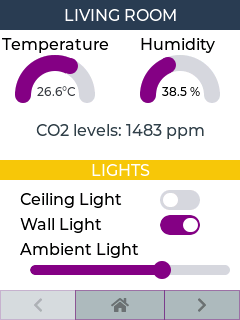

<h1>Dash UI</h1>

## Code

`pages.jsonl` file:

```json
{"page":0,"comment":"---------- Page 0 ----------"}
{"id":0,"bg_color":"#FFFFFF","text_color":"#000000","radius":0,"border_side":0}
{"objid":10,"id":1,"x":0,"y":0,"w":240,"h":30,"txt":"LIVING ROOM","value_font":22,"bg_color":"#2C3E50","text_color":"#FFFFFF","radius":0,"border_side":0}
{"objid":22,"id":2,"x":5,"y":45,"w":140,"h":100,"max":40,"border_side":0,"type":0,"rotation":0,"start_angle":180,"end_angle":0,"start_angle1":180,"value_font":12,"value_ofs_x":-19,"value_ofs_y":-4,"bg_opa":0}
{"objid":22,"id":3,"x":130,"y":45,"w":140,"h":100,"max":100,"border_side":0,"type":0,"start_angle":180,"end_angle":0,"start_angle1":180,"value_font":12,"value_color":"#000000","value_ofs_x":-19,"value_ofs_y":-4,"bg_opa":0}
{"objid":10,"id":4,"x":0,"y":120,"w":240,"h":20,"val":0,"txt":"CO2 levels: ","radius":0,"border_side":0}
{"objid":12,"id":5,"x":2,"y":35,"w":140,"txt":"Temperature"}
{"objid":12,"id":6,"x":140,"y":35,"w":140,"txt":"Humidity"}
{"objid":10,"id":7,"x":0,"y":160,"w":240,"h":20,"txt":"LIGHTS","bg_color":"#F1C40F","text_color":"#FFFFFF","radius":0,"border_side":0}
{"objid":12,"id":8,"x":20,"y":190,"w":140,"h":20,"txt":"Ceiling Light"}
{"objid":40,"id":9,"x":160,"y":190,"w":40,"h":20,"toggle":"TRUE"}
{"objid":12,"id":10,"x":20,"y":215,"w":140,"h":20,"txt":"Wall Light"}
{"objid":40,"id":11,"x":160,"y":215,"w":40,"h":20,"toggle":"TRUE"}
{"objid":12,"id":12,"x":20,"y":240,"w":200,"h":20,"txt":"Ambient Light"}
{"objid":30,"id":13,"x":30,"y":265,"w":200,"h":10}

{"page":254,"comment":"---------- Page 254 ----------"}
{"page":254,"objid":10,"id":1,"x":0,"y":290,"w":76,"h":30,"opacity":50,"txt":"\uF053","radius":0,"bg_color":"#34495E","text_color":"#000000"}
{"page":254,"objid":10,"id":2,"x":75,"y":290,"w":90,"h":30,"opacity":100,"txt":"\uF015","radius":0,"bg_color":"#34495E","text_color":"#000000"}
{"page":254,"objid":10,"id":3,"x":164,"y":290,"w":76,"h":30,"opacity":100,"txt":"\uF054","radius":0,"bg_color":"#34495E","text_color":"#000000"}
```
## Result

Values for Temperature, Humidity and CO2 Sensor are sent from another device by publishing to the appropriate command topic:

- hasp/lanbon/command/p[0].b[2].val %value% - update Temperature arc value
- hasp/lanbon/command/p[0].b[2].value_str %value%°C - update Temperature text value
- hasp/lanbon/command/p[0].b[3].val %value% - update Humidity arc value 
- hasp/lanbon/command/p[0].b[3].value_str %value% %  - update Humidity text value
- hasp/lanbon/command/p[0].b[4].txt CO2 levels: %value% - update CO2 level value

{: align=left }

<div style="clear:both;"></div>
