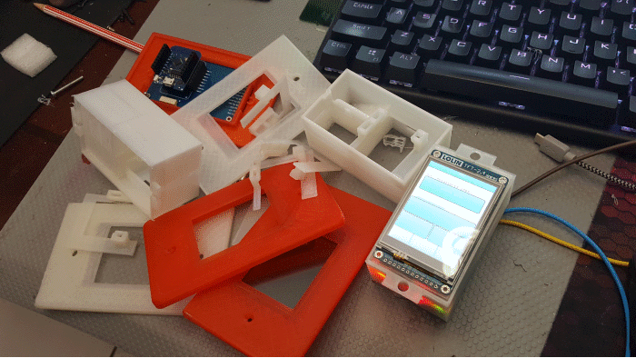
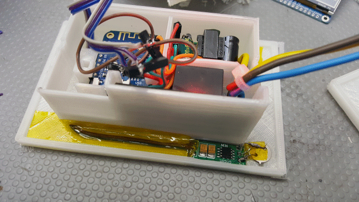
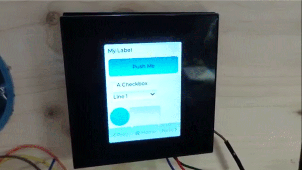
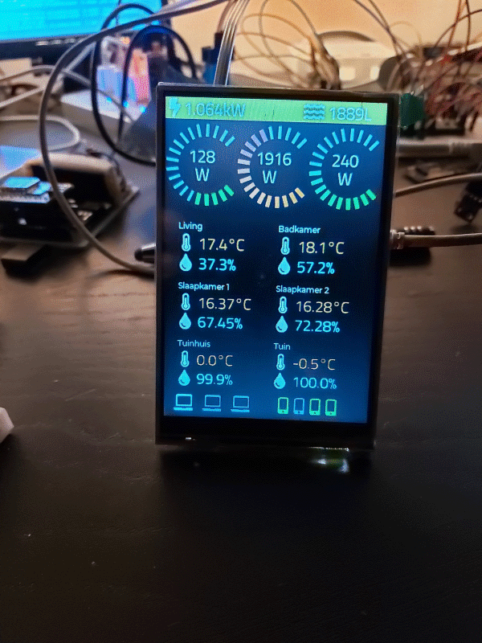

<h1>Gallery</h1>

### Build Pictures

    

        

            
            
            
        

        

            
            
            
        

        

            
            
            
        

    

