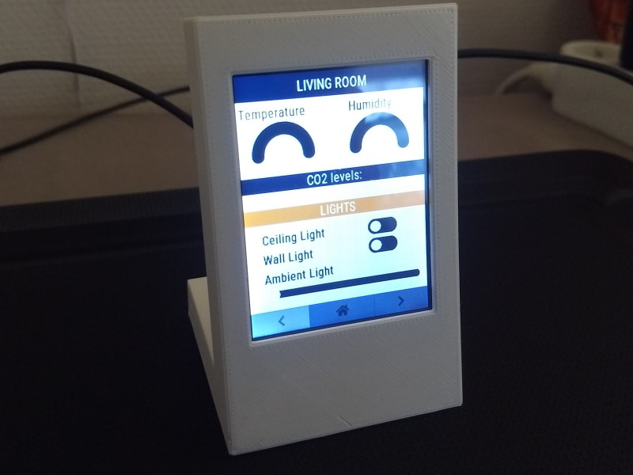
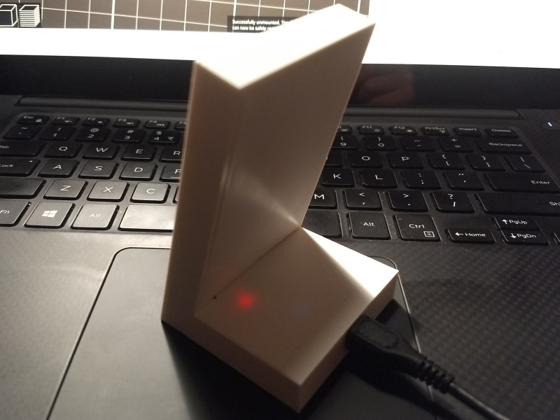
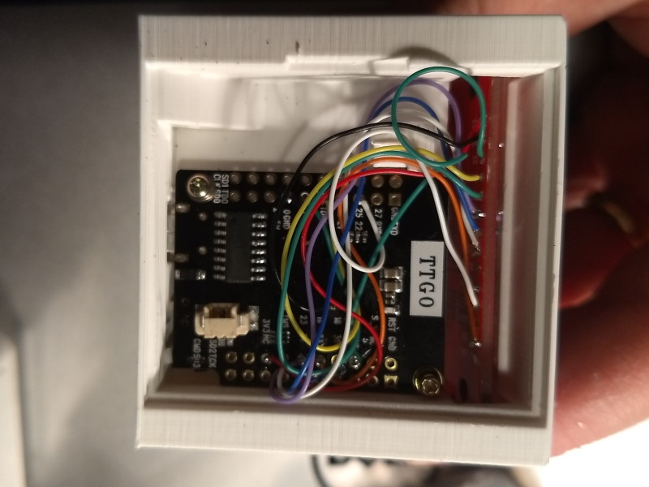

<h1>Gallery</h1>

    

            

            
            
            
        

        

            
            
            
        

        

            
            
            
        

        

            
            
        

    

