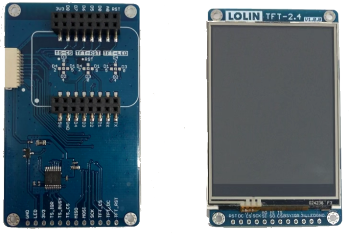
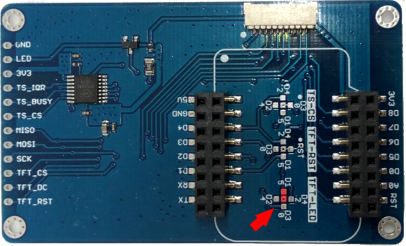
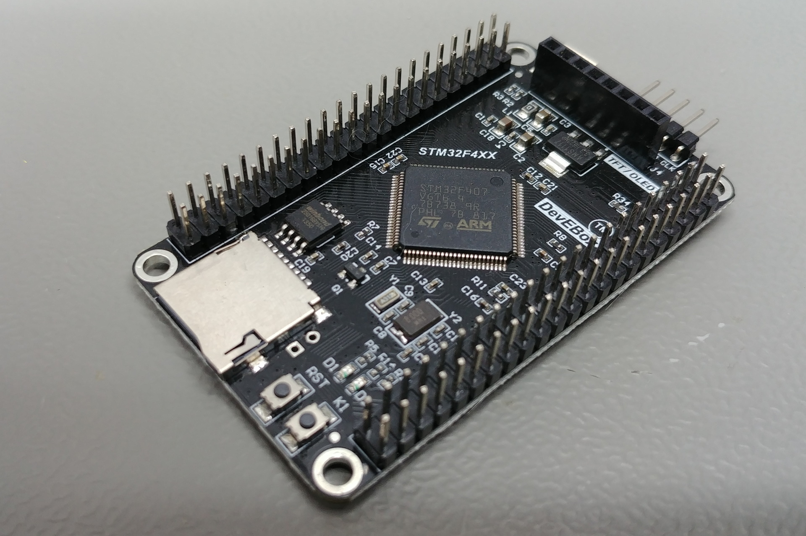
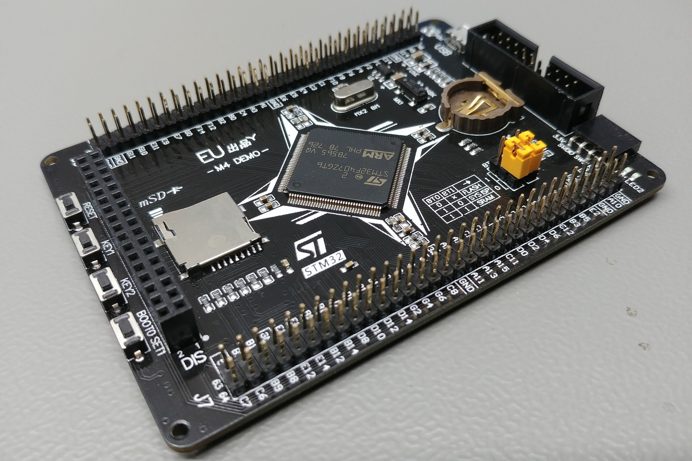
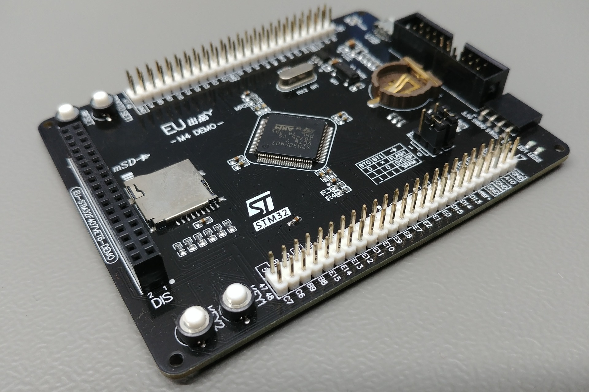
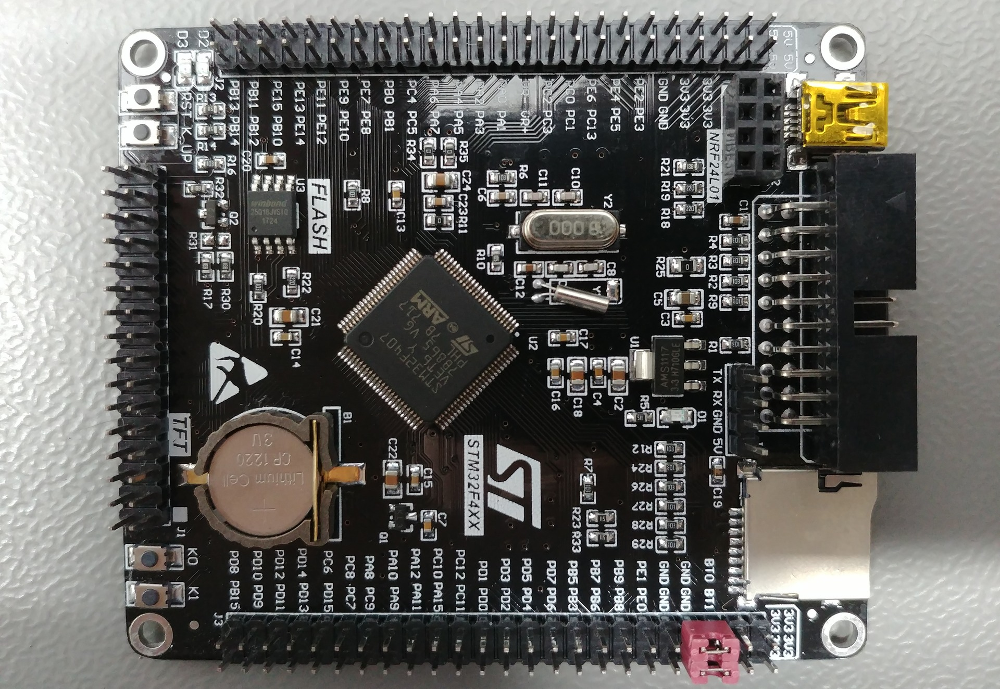
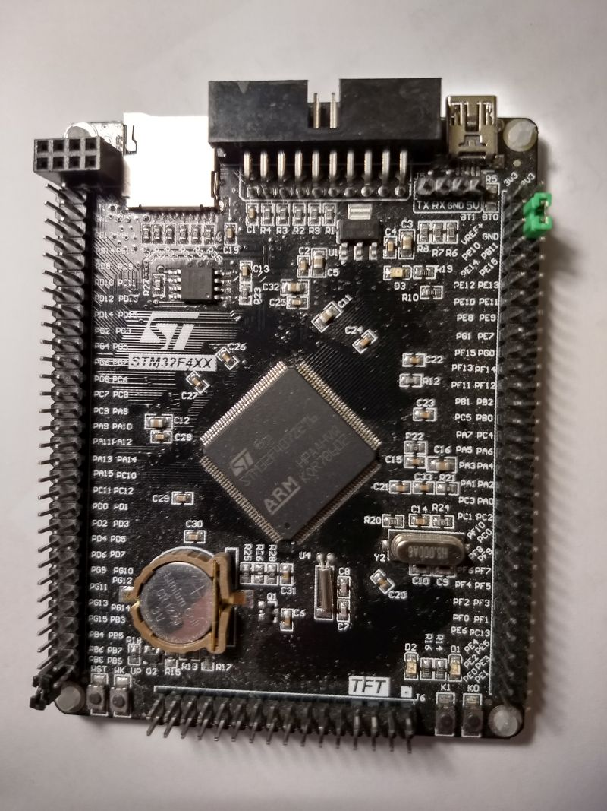

<h1>Hardware</h1>

hasp-lvgl supports the ESP32, ESP8266 and STM32F4 families of microcontrollers.
It needs a compatible micro-controller with drivers supporting the attached display, touch controller, storage and network.

Below is a list of recommended development boards and a TFT touchscreen to get you up-and-running in no time.

## Recommended Boards

|&nbsp;      | Basic       | Standard     | Pro          | Experimental 
|:-----------|:-----------:|:------------:|:------------:|:------------:
| MCU        | ESP8266     | ESP32-WROOM  | ESP32-WROVER | STM32F4      
| CPU Freq.  | 80Mhz       | 240Mhz       | 240Mhz       | 168 MHz      
| Ram        | 80Kb        | 520Kb        | 520Kb        | 192Kb        
| PSRam      | no          | no           | yes          | no           
| Minimal Flash | 4MB         | 4MB          | 4MB          | 512Kb     
| Display    | ILI9341 SPI | ILI9341 SPI  | ILI9341 SPI  | ILI9341 FSMC 
| Touch      | XPT2046 SPI | XPT2046 SPI  | XPT2046 SPI  | XPT2046 SPI  
| Network    | Wi-Fi        | Wi-Fi         | Wi-Fi         | Ethernet / Wi-Fi
| Dev. Board*|[D1 mini ESP8266][3]|[D1 mini ESP32][4]|[TTGO T7 v1.4 Mini32][5]| STM32F407VET/ZGT Black
| Firmware   | [Download][1] | [Download][1]  | [Download][1]  |

[1]: ./installation.md
[3]: https://www.aliexpress.com/item/32643142716.html
[4]: https://www.aliexpress.com/item/32815530502.html
[5]: https://www.aliexpress.com/item/32977375539.html

!!! note " "
    *Due to the large number of possible hardware options a selection of 3 popular ESP development boards has been made for the precompiled binaries.*

!!! warning ""
    Advanced users can [build and compile](../compiling) custom configurations using PlatformIO, however this is not currently supported.

## Recommended Display
### Lolin TFT 2.4"

ILI9341 SPI touchscreens with backlight dimming via PWM are quite cheap to get.
An ILI9341 TFT display with SPI is required when using a pre-built binary.
The touch controller needs to be the XPT2046 Resistive Touch driver.

The Lolin TFT 2.4" is **plug-and-play** with the 3 recommended ESP development boards.
If you have another ESP or MCU, you can still use this display using jumper cables.
You can also solder a row of headers at the bottom of the display to plug it into a breadboard.
Therefor the Lolin TFT 2.4 Touch Shield is used as the development display of choice.

##### Backlight Control

To use PWM dimming on the Lolin TFT 2.4" you must solder the TFT-LED pin to either D1, D2 or D4.
**D1 is recommended** for backlight control and configured by default.

!!! danger "<i class="fa fa-exclamation-triangle"></i> Do *not* use D3 for backlight control because it is already in use for touch!"

!!! warning ""
    It is *not* recommended to use D4 for backlight control because it is already in use for PSram on the ESP32-Wrover.

### Compatible ESP boards

The Lolin TFT 2.4" header is **plug-and-play** compatible with these development boards,
no need to use any jumper cables:

**ESP32:**

- Wemos D1 Mini ESP32 *(**only** solder the inner row of pin headers)*
- TTGO T7 V1.4 MINI32 ESP32 *(**only** solder the inner row of pin headers)*
- LOLIN D32 Pro V2.0.0 *using an **additional** TFT cable*

**ESP8266:**

- Wemos D1 Mini ESP8266
- Lolin D1 Mini Pro ESP8266 V2.0.0

!!! note ""
    If you have a Lolin TFT 2.4" Display and a compatible ESP development board, you have all the hardware that is needed.
    In that case you can skip ahead to the [Firmware Installation](installation.md).

## Alternative SPI Display

Any common ILI9341 320x240 4-wire SPI touchscreen with XPT2046 Resistive Touch driver can be used, like:
- 2.4" SKU: MSP2402
- 2.8" SKU: MSP2807
- 3.2" SKU: MSP3218

You will need to connect the GPIO pins using jumper wires.

## Experimental MCUs

#### STM32F407xxT Black Combo

There are several cheap STM32F407xx Black boards available on the market with a TFT display header
and accompanying 3.2" ILI9341 FSMC screen (320x240). This hardware is experimental and not fully supported.

	<figcaption>Selection of STM32F407 boards.</figcaption>

!!! danger "Make sure to purchase a compatible screen, preferably from the same vendor."

There are multiple FSMC interfaces: e.g. One is marked `TFT`, another is marked `New-TFT` and
a third has no markings.
The pinout of each header & display is different and are **not** interchangeable!

You can however use jumper cables instead, but it won't be plug-and-plug anymore.

The following boards are being tested:

#### STM32F407VET6 Black (v2.1) with 512 KB flash
  
  
  
    <figcaption>STM32F407VET6 Black (v2.0 and v2.1)</figcaption>

- Purchase Links:
    * [AliExpress](https://www.aliexpress.com/item/32618222721.html)
    * [AliExpress](https://www.aliexpress.com/item/33013274704.html)
    * [AliExpress](https://www.aliexpress.com/item/1000006481553.html) (! V2.0 !)
- Documentation can be found on [GitHub](https://github.com/mcauser/BLACK_F407VE) 

#### STM32F407ZGT6 Black (V3.0) with 1 MB flash
  
  
  
    <figcaption>STM32F407ZGT6 Black (v3.0)</figcaption>

- Purchase Link: 
- Documentation can be found on [GitHub](https://github.com/mcauser/BLACK_F407ZG) 

!!! warning "Attention"
    The STM32F4 boards do not have network connectivity. You can use a compatible network adapter and configure it in PlatformIO.

Images of STM32 boards are [CC BY-NC 4.0](https://creativecommons.org/licenses/by-nc/4.0/) from https://stm32-base.org/