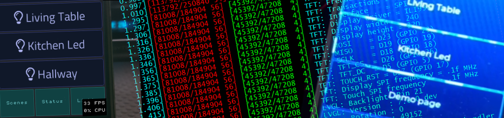
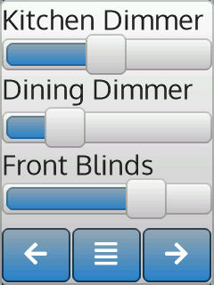
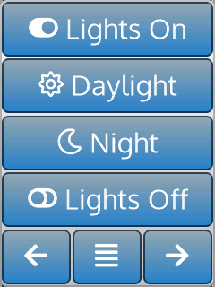
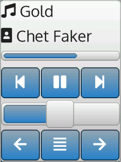

<h1>HASP - Open Hardware edition</h1>

This project is a re-implementation of the popular HASwitchPlate sketch created by aderusha.
The [original HASwitchPlate][1] project uses a Wemos D1 mini and requires a Nextion/TJC HMI display.
This rewrite removes the Nextion/TJC requirement by using the [Littlev Graphics Library][2] on the MCU to drive a cheap commodity display.

This version also adds ESP32 and STM32F4 support to take advantage of the additional hardware capabilities.

## Demo Screens

 &nbsp; 
 &nbsp; 
 &nbsp;
<iframe width=240 height=320 scrolling="no" style="display: block; border-style:none;" src="https://fvanroie.github.io/hasp-docs/lv_ex_roller_1/index.html?w=240&h=320"></iframe>

## Features

| Feature                 | ESP8266 | ESP32   | STM32F4
|-------------------------|---------|---------|----------
| SPI display             | :white_check_mark: yes | :white_check_mark: yes | :white_check_mark: yes
| Parallel display        | :x: no | :white_check_mark: yes | :white_check_mark: yes
| PWM Screen dimming      | :white_check_mark: yes | :white_check_mark: yes | :white_check_mark: yes
| Maximum Page Count      | 4       | 12 | 12
| Object Types / Widgets  | 14      | 15 | 15
| Dynamic Objects         | :white_check_mark: yes | :white_check_mark: yes | :white_check_mark: yes
| [Lvgl Theme Support][3] | basic only | all themes | tbd
| [Custom .zi V5 font][4] | :white_check_mark: yes (latin1) | :white_check_mark: yes (latin1) | no
| [FontAwesome Icons][5]  | :white_check_mark: 1300+ | :white_check_mark: 1300+ | no
| PNG images              | :x: no | :grey_question: tbd | :grey_question: tbd 
| Network                 | :white_check_mark: Wi-Fi | :white_check_mark: Wi-Fi | :white_check_mark: Ethernet

## Support

For support using hasp-lvgl, please join the [#hasp-lvgl channel][6] on Discord.

[1]: https://github.com/aderusha/HASwitchPlate
[2]: https://github.com/littlevgl/lvgl
[3]: https://littlevgl.com/themes
[4]: https://github.com/fvanroie/HMI-Font-Pack/releases
[5]: https://fontawesome.com/cheatsheet/
[6]: https://discord.gg/VCWyuhF
