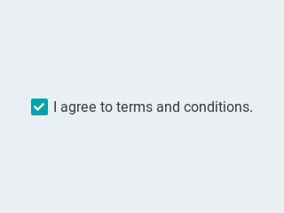
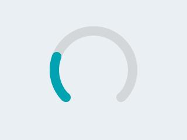
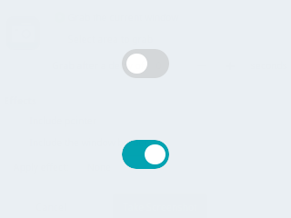
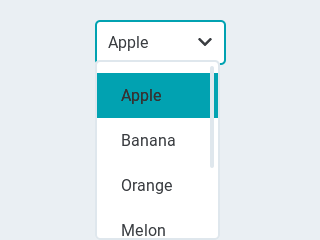

<h1>Objects</h1>

There are two ways to create an object on the screen:

- Uploading a [`pages.jsonl`](pages.md#pagesjsonl) file onto the internal flash
- Use the [`jsonl`](commands.md#multiple-commands) command *(via MQTT, serial or telnet console)*

## Common Properties

These are the common properties shared among all objects,
but only the `id` and `obj` properties are required to create an object:

| Property | Value     | Required | Default | Description
|:---------|:---------:|:--------:|:-------:|:----
| id       | 1..255    | yes      | n/a     | ID of the object on this page
| obj      | string    | yes      | n/a     | Name of the object type *(see below)*
| page     | 0..12     | no       | n/a     | ID of the page the object appears on
| groupid  | 0..15     | no       | 0 (none)| ID of the [GPIO group][3] the object belongs to
| x        | int16     | no       | 0       | horizontal position on the page
| y        | int16     | no       | 0       | vertical position on the page
| w        | int16     | no       | 0       | width of the object
| h        | int16     | no       | 0       | height of the object
| enabled  | [bool][2] | no       | true    | object is clickable
| hidden   | [bool][2] | no       | false   | object is hidden
| opacity  | 0..255    | no       | 255     | how much the the object is opaque
| radius   | uint16    | no       | dep. on theme | the radius of the rounded corners of the object<BR>`0` = square corners<BR>`100` - pill shaped object (true circle if object has same width and height)

If the `page` parameter is not present, the object is placed on the same page as the _previous object_. If `page` is not specified for the first object either, the _current page_ being displayed is used.

The maximum number of pages and objects is limited by the memory available in the MCU.

`"page":0` indicates that the object is visible on **all** pages. It can be used for example to specify a static menu bar.
You can still hide the object on select pages if needed. Objects on page 0 appear on **top** of any objects on the underlying page.

All objects are clickable by default and respond to touch events.
To disable touch events for an object set its `enabled` property to `false`.

## Common Methods

These are the common methods shared among all objects,

| Method   | Parameters | Description |
|:---------|:----------:|:------------|
| delete   |            | Delete the object from the page
| to_front |            | Bring the object to the front on the page
| to_back  |            | Send the object to the back on the page


```json
p1b5.delete
p1b3.to_front
```

## Object Types

Each object type is an ID that indicates which object type that line represents.
Besides the common properties listed above, each object type can have specific properties.

### Cheatsheet

| objid | obj | Type | Description
|:---:|:---------|:-----------|:-----------
| 10 | btn       | Binary | [Button](#button)
| 11 | checkbox  | Binary | [Checkbox](#checkbox)
| 40 | switch    | Binary | [Switch](#switch)
| 32 | bar       | Range | [Progress Bar](#progress-bar)
| 30 | slider    | Range | [Slider](#slider)
| 22 | arc       | Range | [Arc](#arc)
| 33 | lmeter    | Range | [Line Meter](#line-meter)
| 31 | gauge     | Range | [Gauge](#gauge)
| 50 | dropdown  | Selector | [Dropdown List](#dropdown-list)
| 51 | roller    | Selector | [Roller](#roller)
| 13 | btnmatrix | Selector | [Button Matrix](#button-matrix)
| 20 | cpicker   | Selector | [Colorpicker](#colorpicker)
| 91 | obj       | Visual | [Base Object](#base-object)
| 12 | label     | Visual | [Label](#text-label)
| 41 | led       | Visual | [LED](#led-indicator)
| 21 | spinner   | Visual | [Spinner](#spinner)

### Button
**obj:`btn`**


| Property | Value      | Default | Description
|----------|------------|---------|--------------
| toggle   | [bool][2]  | false   | When enabled, creates a toggle-on/toggle-off button. If false, creates a normal button
| val      | int16      | 0       | The value: 1 for toggled, 0 for untoggled
| text     | string     | ""      | The text of the label
| mode     | string     | `expand`| The wrapping mode of long text labels.<br>`expand` = Expand the object size to the text size<br>`break` = Keep the object width, break the too long lines and expand the object height<br>`dots` = Keep the size and write dots at the end if the text is too long<br>scroll = Keep the size and roll the text back and forth<br>`loop` = Keep the size and roll the text circularly<br>`crop` = Keep the size and crop the text out of it

Normal buttons (`toggle=false`) send touch events while they occur. The possible events are:

- `DOWN`: Occurs when a button goes from depressed to pressed
- `SHORT`: The button was released within a short time i.e. a short click has occurred
- `LONG`: Event is send when the button is *still* being pressed after the threshold time
- `UP`: The button is released after being pressing for a LONG threshold time.
<!-- - `HOLD`: The HOLD event is repeated every 400ms while the button is still pressed -->
<!-- - `LOST`: This event occurs when the object looses the focus while the screen is still being touched -->

Toggle Switches (`toggle=true`) send out their new value only when toggled: `{"val":"0"}` or `{"val":"1"}`.

Example:
```json
{"obj":"btn","id":1,"x":10,"y":45,"w":220,"h":55,"toggle":true,"text":"Push Me \uf0a6"}
```


### Checkbox
**obj:`checkbox`**

{: align=center }

| Property | Value      | Default    | Description
|----------|------------|------------|--------------
| val      | int16      | 0          | `1` = checked<br>`0` = unchecked
| text     | string     | "Checkbox" | The label of the checkbox

!!! note "<i class='fa fa-info-circle'></i>&nbsp; Note"
    The checkbox object ignores the `w` and `h` attribute. These are calculated
    based on the font and text.

### Text Label
**obj:`label`**

{: align=center }

| Property | Value      | Default    | Description
|----------|------------|------------|--------------
| text     | string     | "Text"     | The text of the label, `\n` for line break.
| mode     | string     | `crop`     | The wrapping mode of long text labels.<br>`expand` = Expand the object size to the text size<br>`break` = Keep the object width, break the too long lines and expand the object height<br>`dots` = Keep the size and write dots at the end if the text is too long<br>scroll = Keep the size and roll the text back and forth<br>`loop` = Keep the size and roll the text circularly<br>`crop` = Keep the size and crop the text out of it
| align    | 0..2       | 0       | Text alignment: `0` = left, `1` = center, `2` = right

Example:
```json
{"page":2,"id":1,"obj":"label","h":24,"w":120,"text":"\ufe05 Icon Demo"}
```

### Button Matrix
**obj:`btnmatrix`**

{: align=center }

| Property | Value      | Default    | Description
|----------|------------|------------|--------------
| options  | json array | "Text"     | Json array of strings where each element is the label of a button. Use `"\n"` for a new line of buttons.
| align    | 0..2       | 0          | Text alignment: `0` = left, `1` = center, `2` = right


The [styling properties](styling.md) apply to *all* buttons in the matrix.
To change the color of a single label prefix the text with a `#RRGGBB` hexadecimal color code and close with a single hash `#` tag.

Example:
```json
p2b1.options ["#FF0000 Red Text#","#0000FF Cyan Text#","\n","#FFFF00 Yellow Text#"]
```


### Arc
**obj:`arc`**

{: align=center }

| Property  | Value      | Default | Description
|-----------|------------|---------|--------------
| min       | int16      | 0       | minimum value of the indicator
| max       | int16      | 100     | maximum value of the indicator
| val       | int16      | 0       | current value of the indicator
| rotation  | int16      | 0       | offset to the 0 degree position
| type      | 0-2        | 0       | `0` = normal, `1` = symmetrical, `2` = reverse
| adjustable| [bool][2]  | false   | Add knob that the user can operate to change the value
|start_angle| 0-360      |         | start angle of the arc background (see note)
| end_angle | 0-360      |         | end angle of the arc background (see note)
|start_angle1| 0-360     |         | start angle of the arc indicator (see note)
| end_angle1 | 0-360     |         | end angle of the arc indicator (see note)

!!! note
    Zero degree is at the middle right (3 o'clock) of the object and the degrees are increasing in a clockwise direction. The angles should be in the [0-360] range.

### Spinner
**obj:`spinner`**

{: align=center }

| Property  | Value      | Default | Description
|-----------|------------|---------|--------------
| speed     | int16      | 1000    | The time for 1 turn in ms
| direction | int16      | 100     | `0` = clockwise, `1` = counter-clockwise
| thickness | int16      | dep. on theme | The width of the arc line

### Colorpicker
**obj:`cpicker`**

{: align=center }

| Property | Value      | Default | Description
|----------|------------|---------|--------------
| color    | [color][1] | 0       | The selected color in html format #rrggbb
| rect     | [bool][2]    | false   | `true` = color picker has a rectangular shape like a slider. `false` = circular shape.

#### Setting Color

Examples:
```json
p0b2.color=13891
p1b5.color=silver
p2b3.color=#C0C0C0
```

### Slider
**obj:`slider`**

{: align=center }

| Property | Value      | Default | Description
|----------|------------|---------|---------------
| min      | int16      | 0       | minimum value of the indicator
| max      | int16      | 100     | maximum value of the indicator
| val      | int16      | 0       | current value of the indicator

### Double Slider
**objid:30**

| Property | Value      | Default | Description
|----------|------------|---------|---------------
| min      | int16      | 0       | minimum value of the indicator
| max      | int16      | 100     | maximum value of the indicator
| val      | int16      | 0       | current value of the indicator


### Line Meter
**obj:`lmeter`**

{: align=center }

| Property       | Value      | Default | Description
|----------------|------------|---------|---------------
| min            | int16      | 0       | minimum value of the indicator
| max            | int16      | 100     | maximum value of the indicator
| val            | int16      | 0       | current value of the indicator
| angle          | 0-360      | 240     | angle between start and end of the scale
| line_count     | uint16     | 31      | tick count of the scale
| rotation       | 0-360      | 0       | offset for the scale angles to rotate it
| type           | 0-1        | 0       | `0` = indicator lines are activated clock-wise<br>`1` = indicator lines are activated counter-clock-wise

Use [line properties](styling.md#line) to customise.

### Gauge
**obj:`gauge`**

{: align=center }

| Property       | Value      | Default | Description
|----------------|------------|---------|---------------
| min            | int16      | 0       | minimum value of the indicator
| max            | int16      | 100     | maximum value of the indicator
| val            | int16      | 0       | current value of the indicator
| critical_value | int16      | 80      | scale color will be changed to scale_end_color after this value
| angle          | 0-360      | 240     | angle between start and end of the scale
| label_count    | uint8      |         | number of labels (and minor tick count) of the scale
| line_count     | uint16     | 31      | minor tick count of the scale
| rotation       | 0-360      | 0       | offset for the gauge's angles to rotate it
| format         | uint16     | 0       | divider for major tick values

To strip trailing zero's of major tick labels the `format` divider can be used to scale the values before printing:

- `0` : print the major tick value as is
- `1` : strip 1 zero, i.e. divide tick value by 10 before printing the major tick label
- `2` : strip 2 zeros, i.e. divide tick value by 100 before printing the major tick label
- `3` : strip 3 zeros, i.e. divide tick value by 1000 before printing the major tick label
- `4` : strip 4 zeros, i.e. divide tick value by 10000 before printing the major tick label

Only these values are allowed, arbitrary numbers are not supported.

### Progress Bar
**obj:`bar`**

{: align=center }

| Property | Value      | Default | Description
|----------|------------|---------|---------------
| min      | int16      | 0       | minimum value of the indicator
| max      | int16      | 100     | maximum value of the indicator
| val      | int16      | 0       | current value of the indicator


### Switch
**obj:`switch`**

{: align=center }

| Property   | Value      | Default | Description
|------------|------------|---------|---------------
| val        | [bool][2]  | 0       | `1` = on, `0` = off

`bg_color1` changes indicator color and `bg_color2`changes knob color

### LED Indicator
**obj:`led`**

{: align=center }

| Property   | Value      | Default | Description
|------------|------------|---------|---------------
| val        | byte       | 0       | The brightness of the indicator [`0..255`]

### Dropdown List
**obj:`dropdown`**

{: align=center }

| Property | Value      | Default | Description
|----------|------------|---------|--------------------------
| options  | string     | ""      | List of items separated by `\n`
| val      | int16      | 0       | The number of the selected item
| text     | string     | ""      | *Read-only* The text of the selected item

To change the currently selected item, use the `val` attribute.    
To change the items in the list, use the `options` attribute.

When the item is changed both `val` and `text` of the newly selected item are send out.


### Roller
**obj:`roller`**

<iframe width=320 height=240 scrolling="no" style="display: block; border-style:none;" src="https://fvanroie.github.io/hasp-docs/lv_ex_roller_1/index.html?w=320&h=240"></iframe><p></p>


| Property | Value      | Default | Description
|----------|------------|---------|--------------------------
| options  | string     | ""      | List of items separated by `\n`
| val      | int16      | 0       | The number of the selected item
| text     | string     | ""      | *Read-only* The text of the selected item
| rows     | int8       | 3       | The number of rows that are visible<BR>Use this property instead of `h` to set object height
| align    | 0..2       | 0       | Text alignment: `0` = left, `1` = center, `2` = right

To change the currently selected item, use the `val` attribute.    
To change the items in the list, use the `options` attribute.

When the item is changed both `val` and `text` of the newly selected item is sent out.

### Base Object
**obj:`obj`**


The Base Object can be directly used as a simple widget. It is nothing more then a (rounded) rectangle.

You can use it as a background shape for other objects by putting its jsonl line before the object. 

[1]: styling.md#colors
[2]: styling.md#boolean
[3]: configuration/gpio.md#groupid