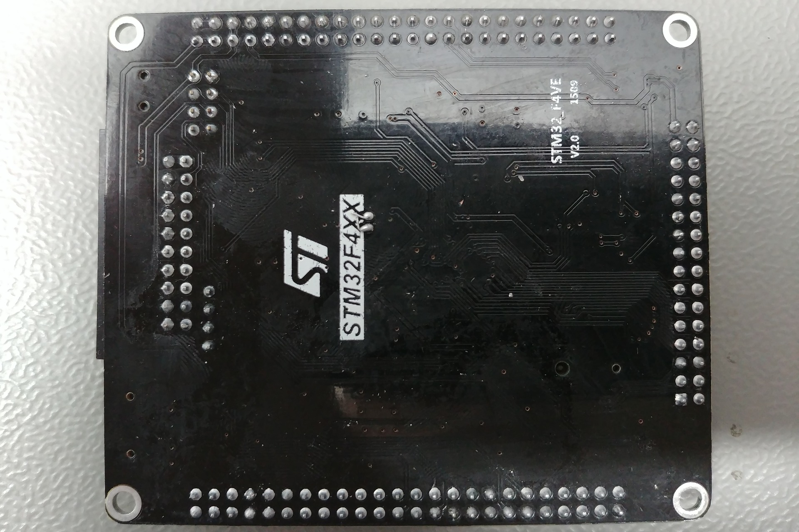
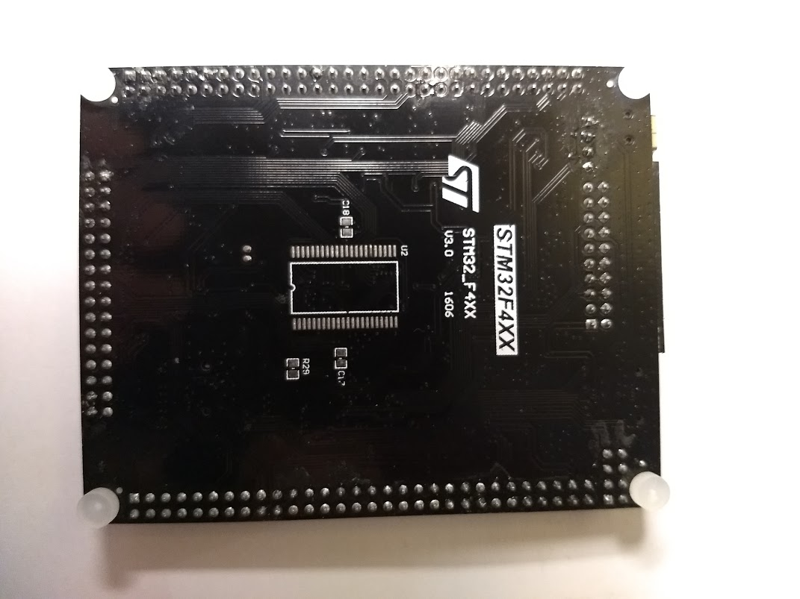

## Experimental MCUs

## Recommended Boards

|&nbsp;      | Basic       | Standard     | Pro          | Experimental 
|:-----------|:-----------:|:------------:|:------------:|:------------:
| MCU        | ESP8266     | ESP32-WROOM  | ESP32-WROVER | STM32F4      
| CPU Freq.  | 80Mhz       | 240Mhz       | 240Mhz       | 168 MHz      
| Ram        | 80Kb        | 520Kb        | 520Kb        | 192Kb        
| PSRam      | no          | no           | yes          | no           
| Minimal Flash | 4MB         | 4MB          | 4MB          | 512Kb     
| Display    | ILI9341 SPI | ILI9341 SPI  | ILI9341 SPI  | ILI9341 FSMC 
| Touch      | XPT2046 SPI | XPT2046 SPI  | XPT2046 SPI  | XPT2046 SPI  
| Network    | Wi-Fi        | Wi-Fi         | Wi-Fi         | Ethernet / Wi-Fi
| Dev. Board*|[D1 mini ESP8266][3]|[D1 mini ESP32][4]|[TTGO T7 v1.5 Mini32][5]| STM32F407VET/ZGT Black
| Firmware   | [Download][1] | [Download][1]  | [Download][1]  |

[1]: ./installation.md

#### STM32F407xxT Black Combo

There are several cheap STM32F407xx Black boards available on the market with a TFT display header
and accompanying 3.2" ILI9341 FSMC screen (320x240). This hardware is experimental and not fully supported.

	<figcaption>Selection of STM32F407 boards.</figcaption>

!!! danger "Make sure to purchase a compatible screen, preferably from the same vendor."

There are multiple FSMC interfaces: e.g. One is marked `TFT`, another is marked `New-TFT` and
a third has no markings.
The pinout of each header & display is different and are **not** interchangeable!

You can however use jumper cables instead, but it won't be plug-and-plug anymore.

The following boards are being tested:

#### STM32F407VET6 Black (v2.1) with 512 KB flash
  
  
  
    <figcaption>STM32F407VET6 Black (v2.0 and v2.1)</figcaption>

- Purchase Links:
    * [AliExpress](https://www.aliexpress.com/item/32618222721.html)
    * [AliExpress](https://www.aliexpress.com/item/33013274704.html)
    * [AliExpress](https://www.aliexpress.com/item/1000006481553.html) (! V2.0 !)
- Documentation can be found on [GitHub](https://github.com/mcauser/BLACK_F407VE) 

#### STM32F407ZGT6 Black (V3.0) with 1 MB flash
  
  
  
    <figcaption>STM32F407ZGT6 Black (v3.0)</figcaption>

- Purchase Link: 
- Documentation can be found on [GitHub](https://github.com/mcauser/BLACK_F407ZG) 

!!! warning "Attention"
    The STM32F4 boards do not have network connectivity. You can use a compatible network adapter and configure it in PlatformIO.

Images of STM32 boards are [CC BY-NC 4.0](https://creativecommons.org/licenses/by-nc/4.0/) from https://stm32-base.org/